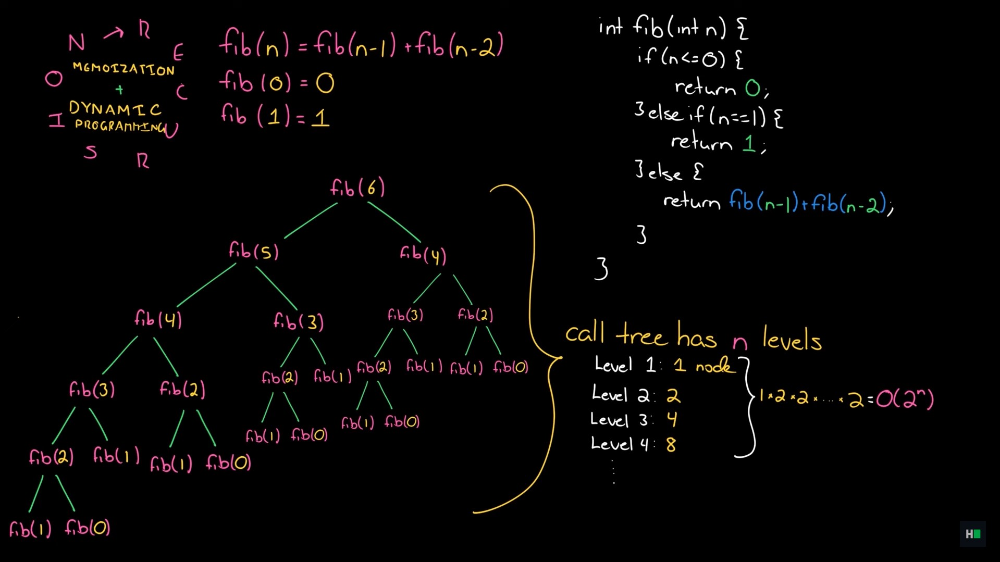

# Dynamic programming

## Fibonacci problem time complexity

The time complexity is O(2 to the power of n) since the first row has 1 node, the second 2, the third 4 ... and so on.

<div style="text-align: center;">
  
  <sub>from <a href="https://www.youtube.com/watch?v=P8Xa2BitN3I">this video</a></sub>
</div>

## Space complexity

Space complexity is the amount of memory an algorithm needs to run to completion

It is typically measured in terms of the size of the input, n. The goal is to determine the relationship between the input size and the amount of extra memory used

### **Definition**

Space complexity refers to the **total amount of working storage** an algorithm uses during execution. This includes:

1. **Fixed part** — memory that doesn’t change with input size (e.g., constants, program instructions, fixed-size variables).
2. **Variable part** — memory that depends on the input size:

   - **Dynamic memory** for variables whose size depends on the input (arrays, lists, hash maps, etc.).
   - **Function call stack space** (from recursion or function calls).
   - **Temporary workspace** used for intermediate calculations.

---

### **Example**

**Example 1:** Sum of an array

```python
def sum_array(arr):
    total = 0       # fixed space
    for x in arr:
        total += x  # loop variable is fixed space
    return total
```

- No extra data structures depending on input size → **O(1)** space complexity.

**Example 2:** Storing a copy of the array

```python
def copy_array(arr):
    new_arr = arr[:]  # extra array of size n
    return new_arr
```

### Tip

It's the maximum amount of space your algorithm uses at the same time, not the memory used across its execution.

## Memoization

is an optimization technique where you store (or "cache") the results of expensive function calls and return the cached result when the same inputs occur again, instead of recomputing them.

It’s like keeping a little “answer notebook” for your functions—when the function is asked a question it has already answered, it just looks it up instead of doing all the work again.

# Explore further memoization.
